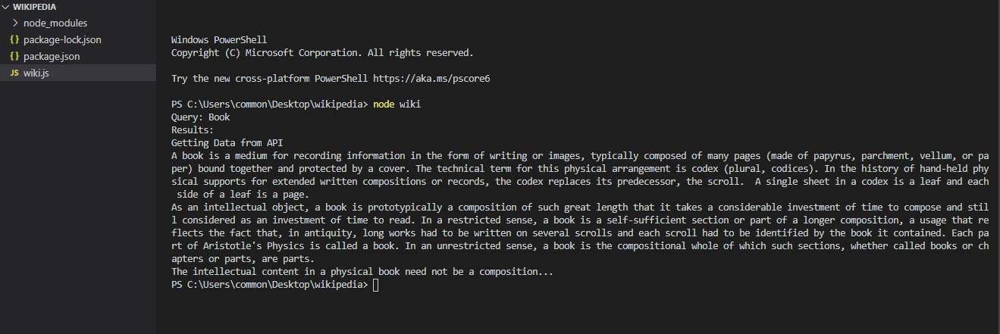

# Wikipedia API

Node js Application

[Download Node.js](https://nodejs.org/en/)

### Run Commands in Command Prompt

`cd <wiki.js file location>`

Install dependencies:

`npm install node-fetch`

`npm install prompt-sync`

Run Wiki.js

`node wiki`

`Query: <your query>`

### Reboot13

[Telegram](https://telegram.me/reboot13_dev) || [Instagram](https://instagram.com/reboot13_dev) || [Twitter](https://twitter.com/reboot13_dev) || [Youtube](https://youtube.com/krutikraut) || [LinkedIN](https://linkedin.com/in/reboot13)
